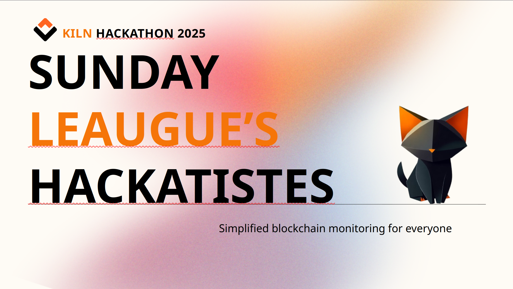
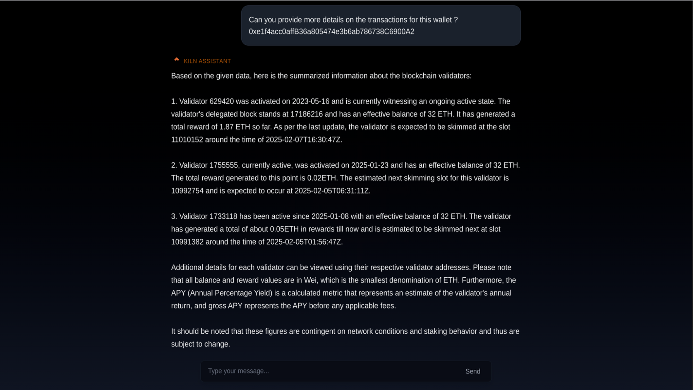
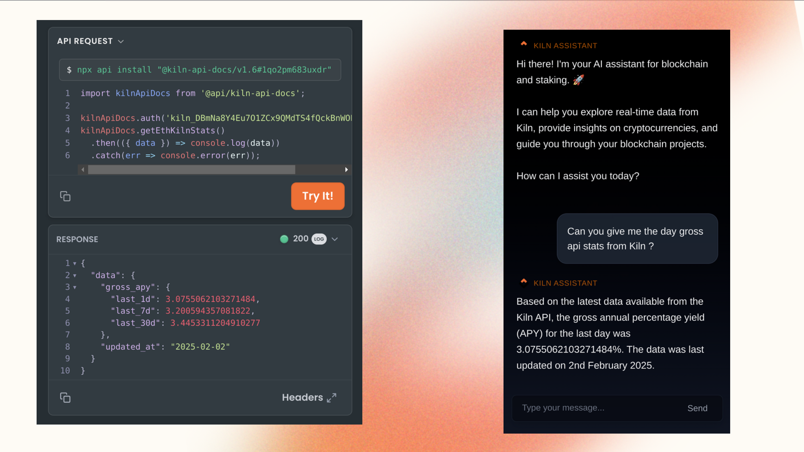
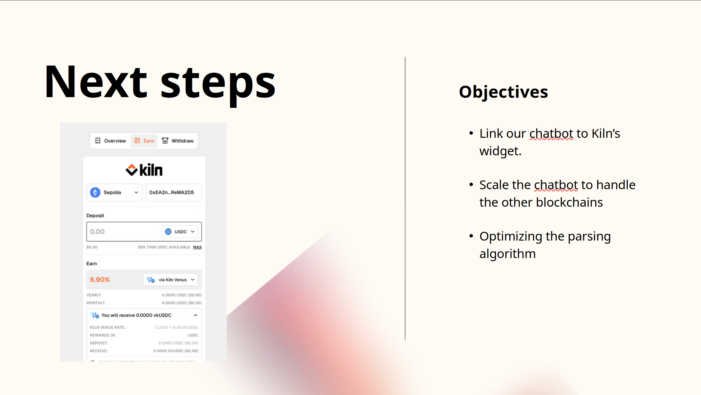

 
 

<strong>Hackathon - Kiln 🐧</strong>

2nd Place WINNERS of the Kiln Connect category! 🏆

This project was developed as a solution for a hackathon organized by Kiln, focusing on innovation and data accessibility in staking and blockchain technology 🏆

 

  <a href="https://www.youtube.com/watch?v=MOEbBAgxb3Y">
    
     
    <strong>Click to watch the demo video</strong>
  </a>

## 🚀 Project Objective

The goal is to provide an AI-powered assistant that both educates on blockchain concepts and can help advanced users quickly retrieve precise, real-time data using Kiln's API. Acting as a bridge to the blockchain, the AI makes information more accessible, and actionable.

 

# Slide presentation

 

## 🔎 Sentiment analysis
The first step is to have the user's prompt go through a simple sentiment analysis using a python script, allowing it to narrow down which data is necessary and from there make the right API call to retrieve it. In a fully fledged version, a more thorough sentiment analysis (Afinn) and allowing it to understand actionable words to enable it to make actions (such as handling: transactions, withdrawing, staking on behalf of the user).

 

## 📡 Integration with Kiln

The aim of this project was to demonstrate a functional proof of concept, for this we decided to limit the data received through Kiln's API to what we thought would be necessary for a MVP. 
For a fully operational version, all Kiln API endpoints should be integrated to maximize the chatbot's capabilities.

The AI is fed real-time data from Kiln's API to provide accurate responses. Currently supported endpoints:

- `Get_Stakes`: Information on validators and associated wallets
- `Get_Reward`: Reward details for a given wallet or validator
- `Get_ETH_Stats`: Global Ethereum network statistics
- `Get_Kiln_Stats`: Kiln-specific activity data on Ethereum
- `Get_Transaction_Status`: Status of an Ethereum transaction

 

## 🔮 Future Improvements

- 🛠 **Blockchain Actions**: Integration of Kiln's UI widget for direct user actions
- 📡 **Extended Kiln API Support**: Add new API endpoints for broader information coverage
- 🤖 **AI Model Enhancement**: Use a blockchain-trained LLM model locally, to improve response quality, privacy and compliance

 

## 🙏 Acknowledgments

Special thanks to Kiln for organizing the hackathon!
