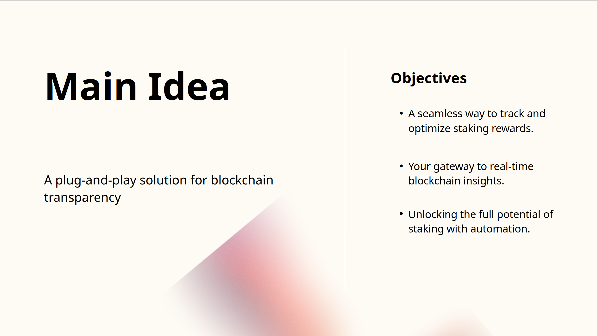

 
 

<strong>Hackathon - Kiln 🐧</strong>

This project was developed as part of a hackathon organized by Kiln, emphasizing innovation and accessibility in staking and blockchain technology 🏆

 

  <a href="https://www.youtube.com/watch?v=MOEbBAgxb3Y">
    
     
    <strong>Click to watch the demo video</strong>
  </a>

## 🚀 Project Objective

The goal is to offer an intelligent assistant capable of delivering precise insights into Ethereum staking, validator performance, and transactions, using Kiln's API. The AI agent acts as a bridge between users and the blockchain, making information more accessible and actionable.

 

# Slide presentation

 

## 📡 Integration with Kiln

The aim of this project was to demonstrate a functional proof of concept. For a real-world integration, all Kiln API endpoints should be integrated to maximize the chatbot's capabilities.

The AI uses Kiln's API to retrieve real-time data and provide accurate responses. Currently supported endpoints:

- `Get_Stakes`: Information on validators and associated wallets
- `Get_Reward`: Reward details for a given wallet or validator
- `Get_ETH_Stats`: Global Ethereum network statistics
- `Get_Kiln_Stats`: Kiln-specific activity data on Ethereum
- `Get_Transaction_Status`: Status of an Ethereum transaction

 

## 🔮 Future Enhancements

- 🛠 **Blockchain Actions**: Integration of Kiln's UI widget for direct user actions
- 📡 **Extended Kiln API Support**: Adding new requests for broader information coverage
- 🤖 **AI Model Improvement**: Refining responses and offering deeper analytical insights

 

## 🙏 Acknowledgments

Special thanks to Kiln for organizing the hackathon !
